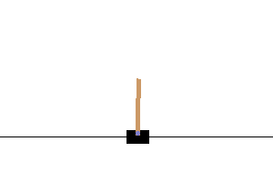
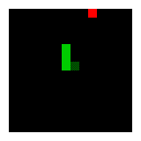

# ai-traineree
[](https://app.travis-ci.com/laszukdawid/ai-traineree)
[](https://ai-traineree.readthedocs.io/)
[](https://codecov.io/gh/laszukdawid/ai-traineree)
[](https://www.codacy.com/gh/laszukdawid/ai-traineree/dashboard?utm_source=github.com&amp;utm_medium=referral&amp;utm_content=laszukdawid/ai-traineree&amp;utm_campaign=Badge_Grade)
[](https://discord.gg/n4bN7ZHn)
[](https://zenodo.org/badge/latestdoi/267484000)

The intention is to have a zoo of Deep Reinforcment Learning methods and showcasing their application on some environments.

Read more in the doc: [ReadTheDocs AI-Traineree](https://ai-traineree.readthedocs.io/).




## Why another?

The main reason is the implemention philosophy.
We strongly believe that agents should be emerged in the environment and not the other way round.
Majority of the popular implementations pass environment instance to the agent as if the agent was the focus point.
This might ease implementation of some algorithms but it isn't representative of the world;
agents want to control the environment but that doesn't mean they can/should.

That, and using PyTorch instead of Tensorflow or JAX.

## Quick start

To get started with training your RL agent you need three things: an agent, an environment and a runner. Let's say you want to train a DQN agent on OpenAI CartPole-v1:
```python
from ai_traineree.agents.dqn import DQNAgent
from ai_traineree.runners.env_runner import EnvRunner
from ai_traineree.tasks import GymTask

task = GymTask('CartPole-v1')
agent = DQNAgent(task.obs_space, task.action_space)
env_runner = EnvRunner(task, agent)

scores = env_runner.run()
```

or execute one of provided examples
> \$ python -m examples.cart_dqn

That's it.

## Installation

### PyPi (recommended)

The quickest way to install package is through `pip`.

> \$ pip install ai-traineree

### Git repository clone

As usual with Python, the expectation is to have own virtual environment and then pip install requirements. For example,
```bash
> python -m venv .venv
> git clone git@github.com:laszukdawid/ai-traineree.git
> source .venv/bin/activate
> python setup.py install
```

## Current state

### Playing gym
One way to improve learning speed is to simply show them how to play or, more researchy/creepy, provide a proper seed.
This isn't a general rule, since some algorithms train better without any human interaction, but since you're on GitHub... that's unlikely your case.
Currently there's a script [`interact.py`](scripts/interact.py) which uses OpenAI Gym's play API to record moves and AI Traineree to store them
in a buffer. Such buffers can be loaded by agents on initiation.

This is just a beginning and there will be more work on these interactions.

*Requirement*: Install `pygame`.

### Agents

| Short   | Progress                                      | Link                                                                                                           | Full name                                                 | Doc                                                                      |
| ------- | --------------------------------------------- | -------------------------------------------------------------------------------------------------------------- | --------------------------------------------------------- | ------------------------------------------------------------------------ |
| DQN     | [Implemented](ai_traineree/agents/dqn.py)     | [DeepMind](https://deepmind.com/research/publications/human-level-control-through-deep-reinforcement-learning) | Deep Q-learning Network                                   | [Doc](https://ai-traineree.readthedocs.io/en/latest/agents.html#dqn)     |
| DDPG    | [Implemented](ai_traineree/agents/ddpg.py)    | [arXiv](https://arxiv.org/abs/1509.02971)                                                                      | Deep Deterministic Policy Gradient                        | [Doc](https://ai-traineree.readthedocs.io/en/latest/agents.html#ddpg)    |
| D4PG    | [Implemented](ai_traineree/agents/d4pg.py)    | [arXiv](https://arxiv.org/abs/1804.08617)                                                                      | Distributed Distributional Deterministic Policy Gradients | [Doc](https://ai-traineree.readthedocs.io/en/latest/agents.html#d4pg)    |
| TD3     | [Implemented](ai_traineree/agents/td3.py)     | [arXiv](https://arxiv.org/abs/1802.09477)                                                                      | Twine Delayed Deep Deterministic policy gradient          | [Doc](https://ai-traineree.readthedocs.io/en/latest/agents.html#td3)     |
| PPO     | [Implemented](ai_traineree/agents/ppo.py)     | [arXiv](https://arxiv.org/abs/1707.06347)                                                                      | Proximal Policy Optimization                              | [Doc](https://ai-traineree.readthedocs.io/en/latest/agents.html#ppo)     |
| SAC     | [Implemented](ai_traineree/agents/sac.py)     | [arXiv](https://arxiv.org/abs/1801.01290)                                                                      | Soft Actor Critic                                         | [Doc](https://ai-traineree.readthedocs.io/en/latest/agents.html#sac)     |
| TRPO    |                                               | [arXiv](https://arxiv.org/abs/1502.05477)                                                                      | Trust Region Policy Optimization                          |
| RAINBOW | [Implemented](ai_traineree/agents/rainbow.py) | [arXiv](https://arxiv.org/abs/1710.02298)                                                                      | DQN with a few improvements                               | [Doc](https://ai-traineree.readthedocs.io/en/latest/agents.html#rainbow) |

### Multi agents

We provide both Multi Agents agents entities and means to execute them against supported (below) environements.
However, that doesn't mean one can be used without the other.

| Short  | Progress                                          | Link                                      | Full name              | Doc                                                                          |
| ------ | ------------------------------------------------- | ----------------------------------------- | ---------------------- | ---------------------------------------------------------------------------- |
| IQL    | [Implemented](ai_traineree/multi_agent/iql.py)    |                                           | Independent Q-Learners | [Doc](https://ai-traineree.readthedocs.io/en/latest/multi_agent.html#iql)    |
| MADDPG | [Implemented](ai_traineree/multi_agent/maddpg.py) | [arXiv](https://arxiv.org/abs/1706.02275) | Multi agent DDPG       | [Doc](https://ai-traineree.readthedocs.io/en/latest/multi_agent.html#maddpg) |

### Loggers

Supports using Tensorboard (via PyTorch's [SummaryWriter](https://pytorch.org/docs/stable/tensorboard.html)) and [Neptune](https://neptune.ai) to display metrics. Wrappers are provided as `TensorboardLogger` and `NeptuneLogger`.

*Note*: In order to use Neptune one needs to install [neptune-client](https://pypi.org/project/neptune-client/) (`pip install neptune-client`).

### Environments

| Name                 | Progress           | Link                                                                                         |
| -------------------- | ------------------ | -------------------------------------------------------------------------------------------- |
| OpenAI Gym - Classic | Done               |
| OpenAI Gym - Atari   | Done               |
| OpenAI Gym - MuJoCo  | Not interested.    |
| PettingZoo           | Initial support    | [Page](https://www.pettingzoo.ml/) / [GitHub](https://github.com/PettingZoo-Team/PettingZoo) |
| Unity ML             | Somehow supported. | [Page](https://unity3d.com/machine-learning)                                                 |
| MAME Linux emulator  | Interested.        | [Official page](https://www.mamedev.org/)                                                    |

### Development

We are open to any contributions. If you want to contribute but don't know what then feel free to reach out (see Contact below).
The best way to start is through updating documentation and adding tutorials.
In addition there are many other things that we know of which need improvement but also plenty that we don't know of.

Setting up development environment requires installing `dev` and `test` extra packages.
The `dev` extras are for mainly for linting and formatting, and the `test` is for running tests.
We recommend using `pip` so to install everything requires for development run

```bash
$ pip install -e .[dev,test]
```

Once installed, please configure your IDE to use `black` as formatter, `pycodestyle` as linter,
and `isort` for sorting imports. All these are included in the `dev` extra packages.

### Contact

Should we focus on something specificallly? Let us know by opening a feature request [GitHub issue](https://github.com/laszukdawid/ai-traineree/issues) or contacting through [ai-traineree@dawid.lasz.uk](mailto:ai-traineree@dawid.lasz.uk).

## Citing project

```latex
@misc{ai-traineree,
  author = {Laszuk, Dawid},
  title = {AI Traineree: Reinforcement learning toolset},
  year = {2020},
  publisher = {GitHub},
  journal = {GitHub repository},
  howpublished = {\url{https://github.com/laszukdawid/ai-traineree}},
}
```
